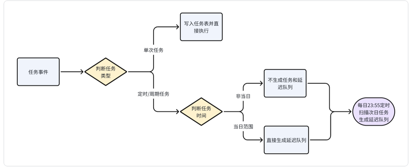

## 简介

- 简易的、轻量的、分布式的、基于RocketMQ的消息队列的定时任务组件
- 支持多种定时任务类型，包括单次、固定间隔、固定时间、Cron表达式等

## 任务类型

### 定时任务
- 根据cron执行或触发任务
- T+1数据统计

### 单次任务
- 多长时间后执行一次任务
- 任务提醒，消息通知

### 周期任务
- 根据开始时间、结束时间、间隔时间执行或触发任务
- 周期性任务提醒日程提醒

## 任务执行器

### Http执行器
- 同步rest接口调用
- 默认post请求，json 请求体

### Rocketmq执行器
- 异步消息发送

### 并行执行器
- 并行执行多个任务
- 适用于耗时任务，提高任务执行效率

